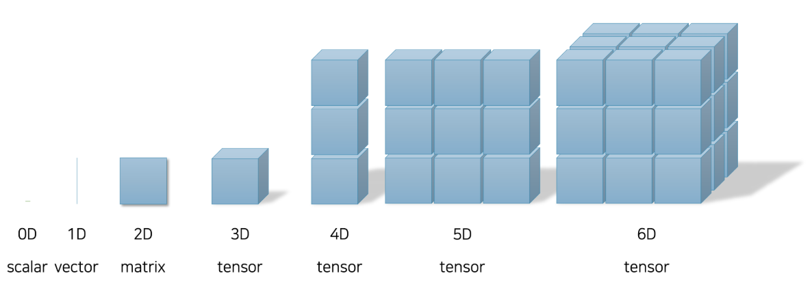
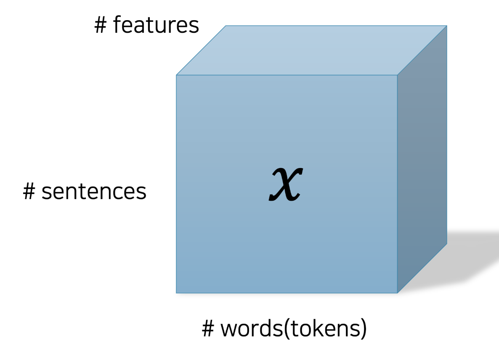

### PyTorch

* PyTorch is an open-source machine learning library, widely used for deep learning research and production. It offers dynamic computation graphs, strong GPU acceleration, and integration with Python, making it a popular framework for building and training neural networks.

* [Documentation](https://pytorch.org/)

* [Installation](https://pytorch.org/get-started/locally/)

### Tensors

- Tensors are the core data structure in PyTorch, similar to NumPy arrays but with GPU acceleration support.

- Each value is stored in memory differently depending on its dimensionality. 
    - A scalar can be represented as a single variable, while a vector is stored as a one-dimensional array. 
    - A matrix is represented as a two-dimensional array. 
    - From three dimensions and up, we refer to these structures collectively as tensors. Note that only scalars, vectors, and matrices have specific names; anything with three or more dimensions is generally referred to simply as a tensor.

### NLP data types   

In NLP, the primary type of data we deal with is sentence data. A sentence is a sequence of words (or *tokens*), which makes it a form of *sequential* data. The properties of sequential data are defined by the occurrence and order of the internal tokens.

Since each word (token) carries meaning, we represent each of them using a vector that captures that meaning (i.e., word embedding vector). When these word vectors are combined, they form a sentence. That means the sequence of word embeddings can be represented as a matrix. 

To enable batch processing of multiple sentence matrices, we group them together into a 3D tensor.

Each sentence in the dataset can be represented as a tensor of shape *(N, ℓ, d)*, where:

- **N** is the number of sentences in a batch,
- **ℓ** is the maximum sentence length (i.e., the number of tokens in a sentence),
- **d** is the dimensionality of the word embedding vectors.

This representation results in a 3-dimensional tensor. One key challenge in NLP is that sentence lengths can vary significantly across a corpus. As a result, the value of ℓ can differ depending on how we batch or group sentences. This variability makes it difficult to process the data using standard neural network layers (e.g., linear layers) that expect fixed-size inputs.

To address this, NLP models often rely on architectures that can handle variable-length sequences, such as **Recurrent Neural Networks (RNNs)** or **Transformers**, which are designed to model dependencies across tokens regardless of sentence length.

--- 
### References

- Figure reference: [NLP with Deep Learning Blog – Tensor](https://kh-kim.github.io/nlp_with_deep_learning_blog/docs/1-03-pytorch_tutorials/03-tensor/)